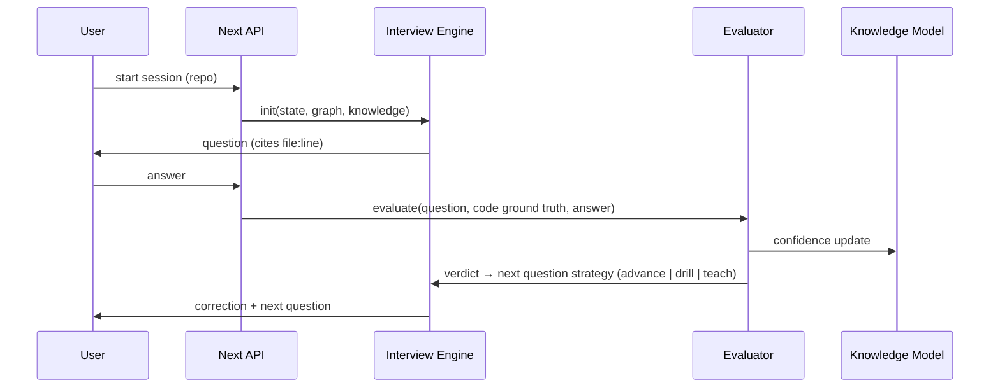
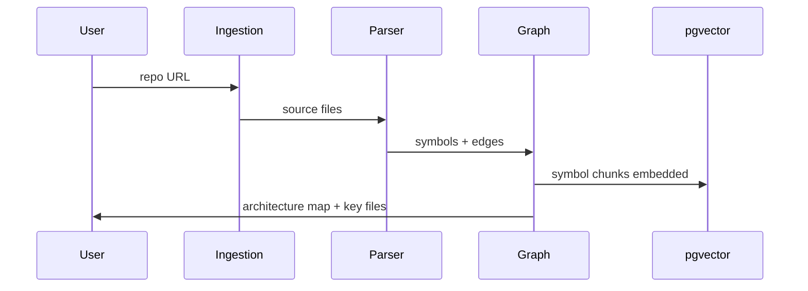

# Depth — Architecture

## Stack (locked)
- TypeScript end-to-end. Next.js 14+ (App Router) — frontend + API routes.
- Postgres + pgvector (Docker locally). Prisma as ORM.
- tree-sitter via node bindings (tree-sitter, tree-sitter-typescript, tree-sitter-python).
- OpenAI API: GPT-5.6 for question generation + evaluation; text-embedding for retrieval.
- shadcn/ui + Tailwind. Mermaid for rendered diagrams.

## Components (pipeline order)
1. **Ingestion** — accept GitHub URL or local path; clone; enumerate source files
   (ts/tsx/js/py); ignore node_modules, build artifacts, lockfiles.
2. **Parser** — tree-sitter per file → symbols (functions, classes, methods),
   imports/exports, call expressions, async boundaries, state mutations.
3. **Graph Builder** — resolve into a structural graph: nodes = symbols/files,
   edges = calls/imports/contains. Compute centrality → "the files that matter."
4. **Retrieval** — chunk code by symbol; embed; store in pgvector. Retrieval =
   vector similarity + graph-neighborhood expansion (pull callers/callees of hits).
5. **Interview Engine** — session state machine. Selects target concept from the
   graph (+ knowledge model), generates a grounded question citing real file:line,
   maintains covered-topics state, adapts difficulty, drills on weak answers.
6. **Evaluator** — SEPARATE pass from question generation. Input: question, the
   actual code context (from graph, i.e. ground truth), user answer. Output:
   verdict (correct / partial / fluent-but-wrong / don't-know), specific
   line-level correction, comprehension delta. Fluent-but-wrong MUST be
   distinguished from correct — this is the product's money feature.
7. **Knowledge Model** — per (user, repo): map of concept → confidence score,
   updated by every evaluated answer, time-decayed.
8. **Report Generator** — Depth Report: overall Depth Score, per-file heatmap,
   blind-trust zones, session history deltas. Shareable via tokenized link.

## Data Model (core entities)
- `Repo` (id, url, name, ingestedAt) → `CodeFile` → `Symbol` (kind, name, file,
  startLine, endLine, embedding) ; `SymbolEdge` (from, to, kind: calls|imports|contains)
- `Session` (id, repoId, userId, mode: learn|assess, state JSON, startedAt, endedAt)
  → `Exchange` (question, groundingRefs[], answer, verdict, correction, timestamps)
- `Knowledge` (userId, repoId, conceptKey, confidence, lastUpdated)
- `Report` (sessionId, score, heatmap JSON, shareToken)
- `AssessmentLink` (token, repoId, createdBy, completedSessionId?)

## Critical Flows




## Build Order Rationale
Parser/graph/retrieval first (highest risk, everything depends on it) →
interview+evaluator (the demo centerpiece) → knowledge/report (the artifact) →
UI last (thin layer over verified engine).

## Directory Map (target — create files as tasks require, follow this layout)

depth/
├── AGENTS.md / PRODUCT.md / ARCHITECTURE.md / DESIGN.md / PLAN.md / DEVLOG.md
├── docker-compose.yml
├── .env.example
├── prisma/
│   └── schema.prisma            # all entities from Data Model section
├── scripts/
│   └── ingest.ts                # CLI entry: npx tsx scripts/ingest.ts <repo-url>
├── src/
│   ├── app/                     # Next.js App Router
│   │   ├── page.tsx             # Screen 1: Home/Repos
│   │   ├── repo/[id]/page.tsx   # Screen 2: Repo Overview (Understand)
│   │   ├── session/[id]/page.tsx# Screen 3: Interview
│   │   ├── repo/[id]/knowledge/page.tsx  # Screen 4: Heatmap
│   │   ├── report/[token]/page.tsx       # Screen 5: Depth Report (public)
│   │   ├── assess/[token]/page.tsx       # Screen 6: Take assessment
│   │   └── api/                 # route handlers: ingest, session, answer, report, links
│   ├── core/                    # THE ENGINE — pure TS, no React, fully testable
│   │   ├── ingestion/           # clone, enumerate, ignore rules
│   │   ├── parser/              # tree-sitter wrappers per language
│   │   ├── graph/               # graph build, edges, centrality, "files that matter"
│   │   ├── retrieval/           # chunking, embeddings, pgvector queries, graph expansion
│   │   ├── interview/           # state machine, question generation, strategies
│   │   ├── evaluator/           # verdict pass, fluent-but-wrong detection
│   │   ├── knowledge/           # confidence updates, decay, depth score
│   │   └── report/              # heatmap + report assembly
│   ├── lib/                     # prisma client, openai client, shared utils
│   └── components/              # UI components (shadcn-based)
└── tests/                       # vitest; mirrors src/core structure

Rules: `src/core` never imports from `src/app` or React. API routes are thin —
all logic lives in `src/core`. One module per PLAN.md task where possible.

## Concrete Specs (authoritative — implement exactly as specified)

### Prisma Schema (draft — refine types as needed, keep shape)
```prisma
generator client {
  provider        = "prisma-client-js"
  previewFeatures = ["postgresqlExtensions"]
}

datasource db {
  provider   = "postgresql"
  url        = env("DATABASE_URL")
  extensions = [pgvector(map: "vector")]
}

model Repo {
  id         String   @id @default(cuid())
  url        String
  name       String
  ingestedAt DateTime @default(now())
  files      CodeFile[]
  symbols    Symbol[]
  sessions   Session[]
  knowledge  Knowledge[]
}

model CodeFile {
  id     String @id @default(cuid())
  repoId String
  repo   Repo   @relation(fields: [repoId], references: [id])
  path   String
  symbols Symbol[]
}

model Symbol {
  id        String @id @default(cuid())
  repoId    String
  repo      Repo   @relation(fields: [repoId], references: [id])
  fileId    String
  file      CodeFile @relation(fields: [fileId], references: [id])
  kind      String   // function | class | method
  name      String
  startLine Int
  endLine   Int
  embedding Unsupported("vector(1536)")?
  outgoing  SymbolEdge[] @relation("from")
  incoming  SymbolEdge[] @relation("to")
}

model SymbolEdge {
  id       String @id @default(cuid())
  fromId   String
  from     Symbol @relation("from", fields: [fromId], references: [id])
  toId     String
  to       Symbol @relation("to", fields: [toId], references: [id])
  kind     String // calls | imports | contains
}

model Session {
  id        String   @id @default(cuid())
  repoId    String
  repo      Repo     @relation(fields: [repoId], references: [id])
  userId    String
  mode      String   // learn | assess
  state     Json
  startedAt DateTime @default(now())
  endedAt   DateTime?
  exchanges Exchange[]
  report    Report?
}

model Exchange {
  id            String   @id @default(cuid())
  sessionId     String
  session       Session  @relation(fields: [sessionId], references: [id])
  question      String
  groundingRefs Json     // [{file, startLine, endLine}]
  answer        String?
  verdict       String?  // correct | partial | fluent_but_wrong | dont_know
  correction    String?
  createdAt     DateTime @default(now())
}

model Knowledge {
  id          String   @id @default(cuid())
  repoId      String
  repo        Repo     @relation(fields: [repoId], references: [id])
  userId      String
  conceptKey  String
  confidence  Float    @default(0)
  lastUpdated DateTime @updatedAt
  @@unique([repoId, userId, conceptKey])
}

model Report {
  id         String   @id @default(cuid())
  sessionId  String   @unique
  session    Session  @relation(fields: [sessionId], references: [id])
  score      Float
  heatmap    Json
  shareToken String   @unique @default(cuid())
  createdAt  DateTime @default(now())
}

model AssessmentLink {
  id                 String   @id @default(cuid())
  token              String   @unique @default(cuid())
  repoId             String
  createdBy          String
  completedSessionId String?
  createdAt          DateTime @default(now())
}
```

### Parsing Method (tree-sitter)
- Use `.scm` tree-sitter query files per language (`queries/typescript.scm`,
  `queries/python.scm`) to extract functions/classes/methods/imports/calls —
  NOT manual AST walking. One query file per language, captured node types
  named consistently (`@function.def`, `@call.expr`, `@import`).
- Async boundaries: capture `await_expression` / `async function` nodes explicitly.

### API Routes (implement exactly these; thin, delegate to src/core)
- `POST /api/repos` — { url } → ingest repo, returns Repo
- `GET /api/repos` — list repos
- `GET /api/repos/:id` — repo detail + graph summary
- `POST /api/sessions` — { repoId, userId, mode } → start session
- `POST /api/sessions/:id/answer` — { answer } → evaluate, return verdict + next question
- `GET /api/sessions/:id/report` — generate/fetch Report
- `POST /api/assessment-links` — { repoId } → create AssessmentLink
- `GET /api/assessment-links/:token` — fetch link, start session on completion

### Question Generator Output Schema (JSON, strict)
```json
{
  "concept": "string",
  "question": "string",
  "groundingRefs": [{ "file": "string", "startLine": 0, "endLine": 0 }],
  "difficulty": "easy | medium | hard"
}
```

### Evaluator Output Schema (JSON, strict — the money feature)
```json
{
  "verdict": "correct | partial | fluent_but_wrong | dont_know",
  "confidence_delta": 0.0,
  "correction": "string, cites specific file:line",
  "reasoning": "string, internal, not shown to user unless teaching"
}
```
Evaluator MUST receive the actual code (ground truth from the graph) alongside
the question and answer — never evaluate from the question text alone.

### Embeddings
- Model: `text-embedding-3-small`.
- Chunk by symbol (one embedding per function/class/method), not by fixed
  token windows.
- Skip re-embedding unchanged files on re-ingestion (hash file content,
  compare before calling the API) — cost/rate-limit guardrail.

### LLM calls
- Question generation + evaluation: `gpt-5.6`, structured output (JSON schema
  above) via response_format / tool-call enforcement, not freeform parsing.